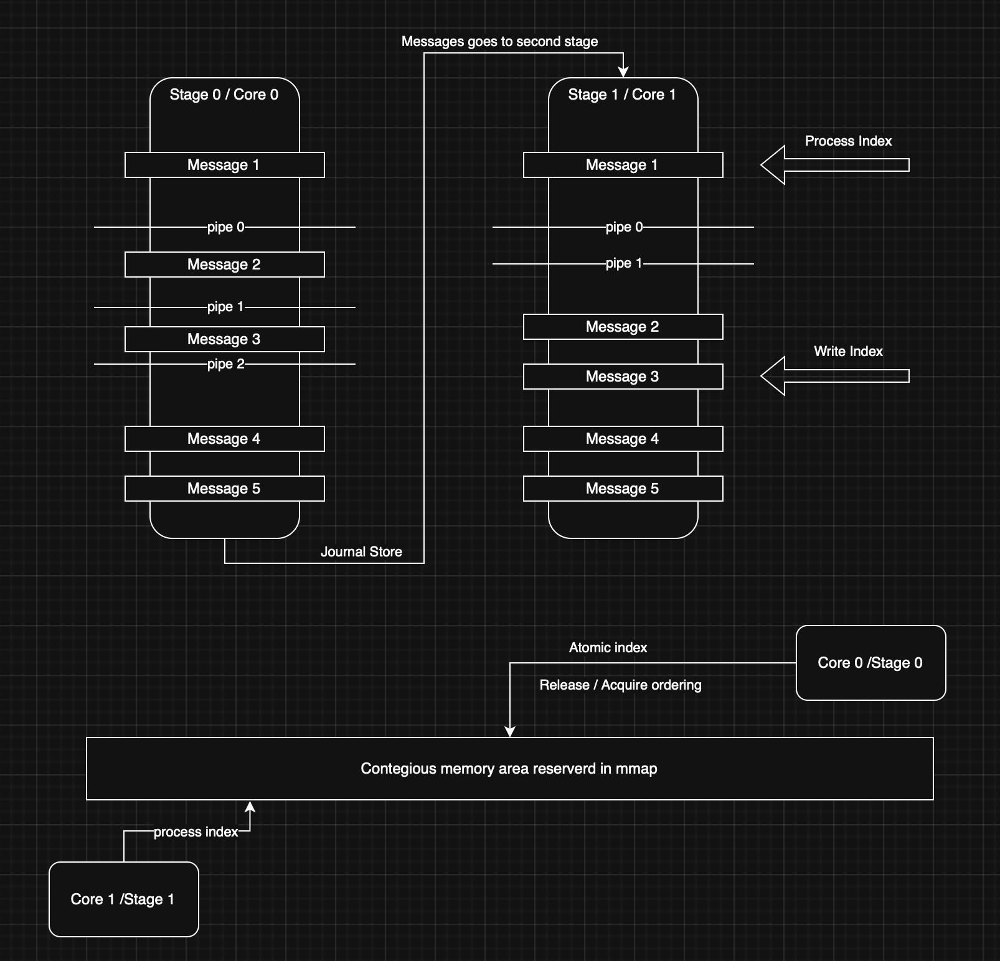

# Roda: Architecture & Design Specification

## 1. Core Philosophy: "The Latency Is The Product"

Roda is built for ultra-high-performance streaming applications—trading systems, real-time analytics, and
telemetry—where deterministic performance is paramount. It adheres to **Mechanical Sympathy**, aligning software design
with hardware realities.

1. **Deterministic Latency:** Every operation has a bounded execution time. We prefer O(1) algorithms over O(log n). No
   memory is allocated on the hot path.
2. **Predictable Cycles:** A "Unit of Work" is constant. Processing $N$ events scales linearly with $N$ in terms of CPU
   cycles.
3. **Explicit Control:** The developer defines the memory bounds and data flow. Roda provides the primitives (Stores,
   Indexes), but the developer orchestrates how they are processed.
4. **Zero-Copy by Default:** Data is not moved; ownership is not transferred. Readers get a **View** (borrowed
   reference) into shared memory regions.
5. **Lock-Free Concurrency:** No `Mutex`, `RwLock`, or condition variables on the data path. Synchronization is achieved
   via **Atomic Sequence Counters** (Acquire/Release semantics).

---

## 2. System Architecture

The system follows a **Shared-Nothing** architecture for logic (workers don't share state directly), but a **Shared-Memory** architecture for data.

### 2.1 The Engine (Orchestrator)

Roda provides two levels of orchestration:

1.  **RodaEngine:** The low-level bootloader. It manages thread lifecycles and provides the factory for creating `JournalStore` and `SlotStore`.
2.  **StageEngine:** A high-level, type-safe pipeline builder. It chains multiple processing stages, automatically managing the intermediate `JournalStore` buffers and spawning worker threads for each stage.

**Core Responsibilities:**

* **Memory Management:** Allocates large, contiguous memory blocks via `mmap` and initializes shared structures (ring buffers, headers).
* **Thread Orchestration:** Spawns long-lived worker threads, optionally pinning them to specific CPU cores for deterministic execution.

**Worker Execution Model:**
Workers execute user pipelines in a continuous loop using an **Adaptive Backoff Strategy** to balance latency and efficiency:

1. **Busy Spin (Hot Path):** Continuously polls cursors for nanosecond-level response times.
2. **CPU Relax (Warm Path):** After empty cycles, emits `PAUSE` instructions (`std::hint::spin_loop`) to reduce power usage.
3. **Park/Sleep (Cold Path):** After extended inactivity, yields the thread to the OS scheduler to save resources until new data arrives.

### 2.2 The Stores (Source of Truth)

Roda uses two primary storage types, both backed by memory-mapped files:

*   **JournalStore<T>:** A fixed-capacity, append-only buffer (a "Journal"). Ideal for event streams, logs, and time-series data.
*   **SlotStore<T>:** A fixed-capacity buffer where items are accessed and updated by their index (or "slot"). Ideal for shared state maps, lookup tables, and order books.

**Characteristics:**

* **Memory Layout:** `[ Header (Atomics) | Data Region (T...) | Padding ]`.
* **Write Model:** **Single Writer**. Only one thread (the owner of the `Store` handle) can write, eliminating
  write-side contention.
* **Read Model:** **Multiple Readers**. Each reader uses an independent `StoreReader` handle that maintains its own
  state (cursor).
* **Addressing:** Data in journals is addressed by a monotonic `u64` sequence number. In slot stores, it is addressed by a direct `usize` index.
* **Full Buffer Policy:** If the store is full, it will panic on the next `push`/`append`. No wrapping or overwriting occurs.

### 2.3 Store Traits & Readers

Roda uses traits to define the behavior of stores and readers, allowing for different implementations.

* **Appendable Trait:** Defines `append` (for `JournalStore`).
* **Settable Trait:** Defines `set` (for `SlotStore`).
* **IterativeReadable Trait:** Defines `next`, `get`, and `get_index` for cursor-based reading.
* **Explicit Advancement:** Each reader maintains its own `LocalCursor`.
  The cursor is moved next everytime `next()` is called.
* **Synchronicity by Design:** Each worker is designed to process a single unit of work in each cycle. Explicit `next()`
  calls give the developer control over when data is consumed.
  If there are no more data to read, the cursor will simply stay at the end of the store. No need to handle any special
  case.

### 2.4 Data Transfer: The Producer-Consumer Loop

Data is transferred between stages without copying or message passing. Instead, Roda uses a **Shared-Memory Producer-Consumer** pattern:

1.  **Shared Memory (mmap):** A `JournalStore` allocates a contiguous memory region.
2.  **Atomic Write Index:** A shared counter (Atomic) that tracks the end of valid data in the store.
3.  **Local Read Index:** A private counter maintained by each `StoreReader` (consumer) to track its own progress.

#### Transfer Flow

#### Step-by-Step Mechanism:
1.  **Stage N (Producer)** appends data to the `Free Slot` (at the current `Write Index`).
2.  The Producer performs an **Atomic Store** with **Release** semantics on the `Write Index`. This ensures that all previous memory writes (the data) are visible to any thread that subsequently loads the index with **Acquire** semantics.
3.  **Stage N+1 (Consumer)** polls the `Write Index` using **Atomic Load** with **Acquire** semantics.
4.  The Consumer compares the `Write Index` with its private `Local Read Index`.
5.  If `Write Index > Local Read Index`, new data is available. The Consumer reads the data directly from the `Data Region` (Zero-Copy) at its `Local Read Index`.
6.  The Consumer increments its `Local Read Index`.

---

### 3. The SlotStore & Indexing

While `JournalStore` provides a chronological record, `SlotStore` allows for O(1) random access to state by "slots".

* **Storage:** Backed by `mmap`, similar to journals.
* **Usage:** Can be used to maintain the "current state" of various entities (e.g., current price of 10,000 different symbols).
* **Consistency:** The developer controls when a slot is updated. Readers use snapshot-based retry logic to ensure they see a consistent version of the data without using locks.

---

## 4. Pipeline Primitives (Stages & Pipes)

Roda enables **Declarative Multistage Pipelines** by chaining `Pipe` components into `Stages`.

* **Stage:** A unit of execution that runs in a dedicated thread. It consumes data from one `JournalStore` and appends results to the next one in the chain.
* **Pipe:** A composable processing logic that can be chained within a single stage using the `pipe!` macro.

**Available Components:**

* **Stateful:** Implements partitioned reduction. It maintains a `HashMap` of state keyed by a user-defined function.
* **Delta:** Compares the current incoming item with the previous one for the same key. Useful for anomaly detection or calculating rates of change.
* **DedupBy:** Filters out redundant items if the calculated key matches the last seen key for that partition.
* **Map/Filter/Inspect:** Standard functional primitives for transformation, filtering, and side-effects.

**Zero-Copy Composition:**
The `pipe!` macro chains components such that they execute sequentially within the same worker loop, minimizing overhead while maintaining a clear, declarative structure.

---

## 5. Technical Constraints & Safety

To guarantee performance and zero-copy safety, Roda imposes several constraints:

* **Fixed-Size POD Types:** `T` must be `Copy`, `Sized`, and satisfy `bytemuck` traits. No `String`, `Vec`, or pointers
  allowed inside a `Store`.
* **Memory Pinning:** Uses `mlock` (via `libc`) to prevent shared memory from being swapped to disk.
* **Alignment:** All structures use `#[repr(C)]` and are aligned to machine word boundaries to support zero-copy casting
  and avoid torn reads.

---

## 6. Implementation Notes: The "Magic" of Atomics

Synchronization is achieved without locks using `Acquire/Release` semantics to coordinate between producers and consumers:

* **Producer (Writer):**
  1. Write data to the buffer.
  2. `write_index.store(new_val, Release);`
* **Consumer (Reader):**
  1. `while write_index.load(Acquire) > local_read_index { ... }`
  2. Process data.
  3. `local_read_index += 1;`

This ensures that when the reader sees the updated `write_index`, the hardware and compiler guarantees that it also sees the corresponding data written by the producer.