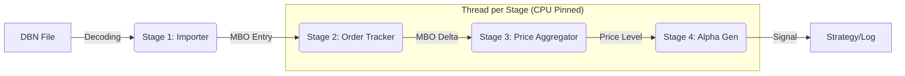

# High-Performance MBO Replay & Alpha Generation

This example demonstrates a production-ready, low-latency market data replay and alpha generation system built on the **Roda Engine**. It is designed to showcase the engineering standards required by top-tier HFT firms in Amsterdam (Optiver, Flow Traders, IMC).

## Key Features

- **End-to-End Latency Observability**: Tracks "Tick-to-Signal" latency from the moment a record is read until the alpha signal is generated, using high-resolution `hdrhistogram`.
- **CPU Affinity & Pinning**: Automatically pins pipeline stage workers to dedicated physical cores to minimize OS scheduling jitter and cache misses.
- **Zero-Allocation Hot Path**: All data models are `Pod` (Plain Old Data) and cache-line aligned (`#[repr(align(64))]`) to prevent false sharing. Stages use `fxhash` for ultra-fast internal state management.
- **Accurate TTS Metrics**: Synchronized time measurement and warm-up stabilization ensure reported Tick-to-Signal latencies represent steady-state production performance.
- **SIMD-Friendly Signal Calculation**: Alpha signals (Weighted Order Book Imbalance) are calculated using vectorized loops that the compiler can easily optimize for SIMD instructions.
- **Real-Time Simulation**: Supports a `--simulate-live` mode to replay historical data at its original exchange-timestamp speed, allowing for realistic system testing.
- **High Throughput**: Capable of processing over **5M+ events per second (MEPS)** on a single core.

## Pipeline Architecture

The system uses a multi-stage threaded pipeline where data flows through wait-free journals. The full implementation can be found in [main.rs](main.rs).



## Data Models

1.  **Normalization (`LightMboEntry`)**: Compact MBO record with `ts_recv` tagging.
2.  **Order Tracking (`MboDelta`)**: Captures the change in volume at a specific price point.
3.  **Aggregation (`BookLevelEntry`)**: Maintains total volume per price level.
4.  **Book State (`BookLevelTop`)**: Top-5 price levels, maintained within the Alpha Gen stage.
5.  **Signal (`ImbalanceSignal`)**: The final alpha output with end-to-end latency metadata.

## Usage

```bash
# High-speed backtest (Maximum throughput)
cargo run --release --example databento_replay -- --file path/to/data.dbn --pin-cores

# Live simulation (Real-time speed)
cargo run --release --example databento_replay -- --file path/to/data.dbn --simulate-live
```

## Performance Metrics

The engine reports:
- **MEPS**: Millions of Events Per Second processed.
- **P99.9 Latency**: Tail latency for both stage execution and end-to-end signal generation.
- **Throughput Stats**: Periodic logs showing the processing rate and average speed.

### Benchmark Results

On a typical performance-tuned environment (`--pin-cores`), the system achieves:

```text
Final Imbalance Signals: 24,191,906
Throughput: 7.40 MEPS (Million Events Per Second)
Execution Time: 3.27s
TTS Latency (Tick-to-Signal): p50=8.0us, p90=28.7us, p99=56.7us, p999=165.4us
```
