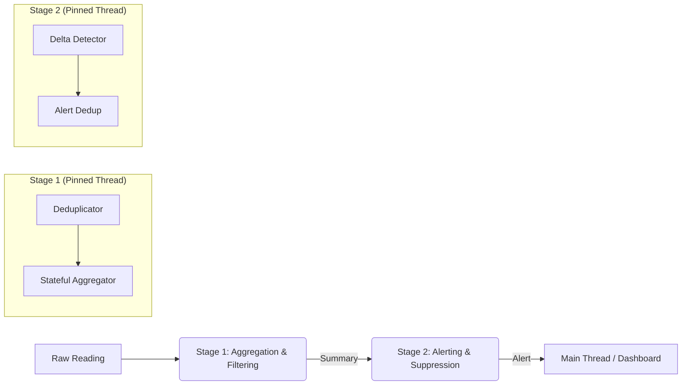

# Service Health Monitoring Pipeline

This example demonstrates a robust, low-latency service health monitoring system built with the **Roda Engine**. It includes noise filtering (deduplication), stateful aggregation, and anomaly detection with alert deduplication.

See [main.rs](main.rs) for the complete source code.

## Key Features

- **Noise Filtering**: Uses the `dedup_by` pipe component to drop redundant raw readings with identical values, reducing downstream load.
- **Hierarchical Pipeline**: Combines multiple processing steps (dedup -> stateful -> inspect) into logical stages.
- **Intelligent Alerting**: 
  - Detects spikes in average values using `delta`.
  - Suppresses duplicate alerts for the same sensor using `dedup_by`, ensuring the monitoring system only notifies on state changes.
- **Performance Observability**:
  - Uses the `latency` pipe to monitor the execution time of each composite stage.
  - Reports end-to-end "Tick-to-Alert" latency for detected anomalies.

## Pipeline Architecture



## Data Models

1.  **Reading**: Raw metric from a service/sensor.
2.  **Summary**: Rolling window of metrics (min, max, avg).
3.  **Alert**: Notifies on significant health degradation (>50% jump in average).

## Usage

```bash
# Run the example with optimizations
cargo run --release --example service_health
```

## Performance Metrics (tested on MacBook M2 Max)

Based on the latest benchmarks ([perf.log](perf.log)):

- **Throughput**: ~19.1 MEPS (Million Events Per Second).
- **Stage Execution**: ~52ns per record (based on wall-clock time for 100M events).
- **Architectural Efficiency**:
    - **Instructions Per Cycle (IPC)**: 1.55 (High pipeline utilization).
    - **Branch Prediction**: 97.2% accuracy (2.76% branch misses).
    - **L1 Cache Performance**: 1.65% dcache misses, 1.12% icache misses (Effective cache-friendly design).
- **End-to-End Latency**: Measured in nanoseconds from ingestion to alert receipt.
